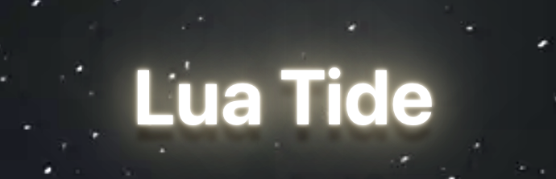

#  

App allows you to search for tides around the world

* Search, access, and save tide related information for your favorites destinations
* Great resource for fishing, surfing and diving
* Learn more about tides and their influence on the environment


### Developed by:

* **Nathalia Troina**


# Demo:
 


 #

 ## Technical Accomplishments 

* Built a full web application using Ruby, Rails and ActiveRecord 
* Designed React front end with custom CSS and implemented full CRUD capabilities
* Built backend PostgreSQL database, using the Bcrypt ruby gem to handle user authorization


**Made With:** 

<a href="https://developer.mozilla.org/en-US/docs/Web/JavaScript" target="_blank" rel="noreferrer">  </a> 
<a href="https://reactjs.org/" target="_blank" rel="noreferrer">  </a> 
<a href="https://www.ruby-lang.org/en/" target="_blank" rel="noreferrer">  </a>
   <a href="https://rubyonrails.org" target="_blank" rel="noreferrer">  </a> 
    <a href="https://www.postgresql.org" target="_blank" rel="noreferrer">  </a>

#

## How to Run This Application:
* Run the following commands in two seperate terminals:

```
// install and start the server
bundle install
rails s 
\
```

